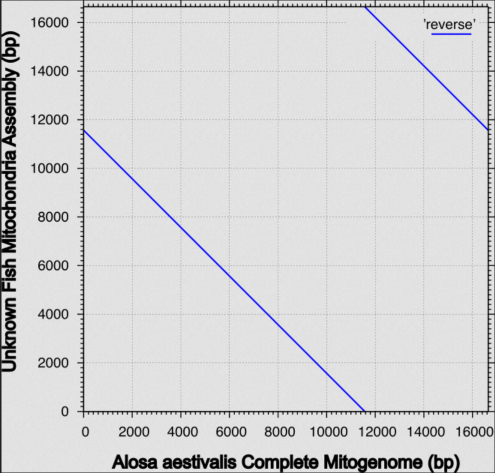

# GEN_711-Project

My project will be assembling the genome of an unknown fish from the Oyster River in order to identify its origin, what species it is, and if it is a hybrid.

## Background

This data originated from me. An unknown fish was caught in the Oyster River by New Hampshire Fish and Game, and I used Oxford Nanopore Technologies GridION to sequence its genome. My goal was to determine the species of the unknown fish, as well as if it is a hybrid. This is important because fish hybridization can make habitat management difficult, as it's hard to estimate the numbers and range of a particular species. New Hampshire Fish and Game suspected that this individual was a blueback herring (_Alosa aestivalis_) however it also showed some shad characteristics not found in blueback herring typically.

## Methods

* Data originated from my sequencing project.
* Data is long read Nanopore sequences, whole genome not a specific metabarcode.
* Analyses were performed on RON as well as using web-based programs.

Programs:
* fastqc
  * This bash program analyzed the quality of the the fastq files and reads. Its output was an html file.
* multiqc
  * This bash program condensed multiple fastqc html files into one viewable html file.
* flye 2.9.5
  * This bash program assembles the genome using the fastq files with the reads. The output is a fasta file with all the contigs, as well as other documents with additional information, such as length, depth, and circularity for each contig.
* blast
  * This bash program compares the contigs made from the genome to the known database of genomes in order to identify the possible species that the genome might be. This also helps to identify which contigs are not from the fish (AKA human or bacterial DNA) so that it can be removed. Output is a text file.
* MAFFT v.7
  * This browser program does multiple alignment for genome sequences. It outputs a phylogenetic tree of the sequences input, as well as a synteny plot. To use this program, I took the mitchondrial genome (contig 70) of my unknown fish, as well as downloading mitochondrial data for closely related fish found in the area to the suspected identity of this fish. This program is how I visualized my data.

## Results

Figure 1. Phylogentic tree with the degrees of similarity between the unknown fish mitochondrial genome and the mitochondrial genomes of five related fish (_A. aestivalis, A. pseudoharengus, A. mediocris, A. sapidissima,_ and _Clupea harengus_). This tree was created through MAFFT with the input of the six mitochondrial genomes (fasta files). This tree shows that the mitochondrial genome of the unknown fish is most closely related to that of _A. aestivalis_, though it is also close to the other _Alosa_ fish.

 

Figure 2. Synteny plot of mitchondrial genomes of the unknown fish and _A. aestivalis_ (blueback herring). Shows the degree of similarity between the two mitochondrial genomes. This plot was created through MAFFT, with the input of the two mitochondrial genomes (fasta files). This synteny plot shows that the genomes are almost one to one, however the unknown fish genome is in the reverse direction, and there seems to be a break in it, although it is a continuous contig.

## Citations

1. Andrews, S. (2010). FastQC:  A Quality Control Tool for High Throughput Sequence Data [Online]. Available online at: http://www.bioinformatics.babraham.ac.uk/projects/fastqc/
2. Camacho, C., Coulouris, G., Avagyan, V., Ma, N., Papadopoulos, J., Bealer, K., and Madden, T.L. 2009. BLAST+: architecture and applications. BMC Bioinformatics, 10, 421.
3. Kazutaka Katoh, John Rozewicki, Kazunori D Yamada, MAFFT online service: multiple sequence alignment, interactive sequence choice and visualization, Briefings in Bioinformatics, Volume 20, Issue 4, July 2019, Pages 1160–1166, https://doi.org/10.1093/bib/bbx108 
4. Mikhail Kolmogorov, Jeffrey Yuan, Yu Lin and Pavel Pevzner, "Assembly of Long Error-Prone Reads Using Repeat Graphs", Nature Biotechnology, 2019 doi:10.1038/s41587-019-0072-8
5. Philip Ewels, Måns Magnusson, Sverker Lundin, Max Käller, MultiQC: summarize analysis results for multiple tools and samples in a single report, Bioinformatics, Volume 32, Issue 19, October 2016, Pages 3047–3048, https://doi.org/10.1093/bioinformatics/btw354 
